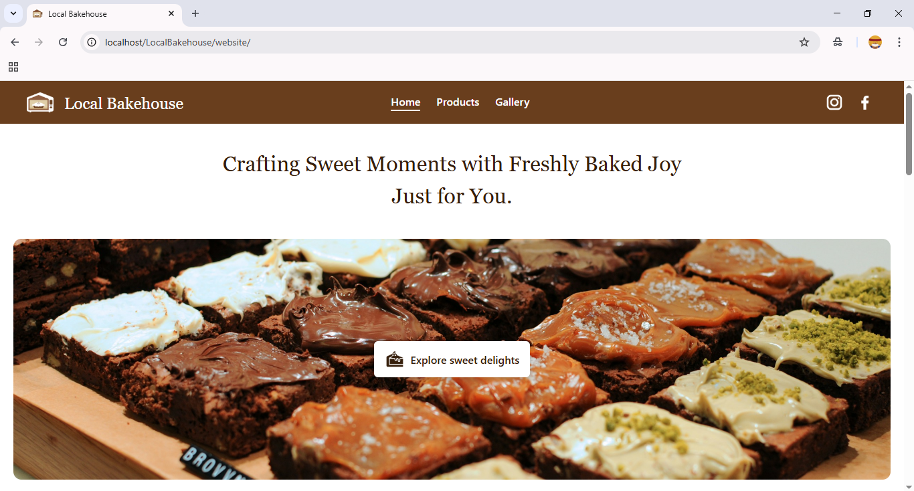

# Bakery Management System

## Abstract

The **Bakery Management System** is a content management website designed to organize and manage bakery-related content such as general information, images, and product listings. Developed using the **Waterfall model**, the system integrates front-end technologies like HTML, CSS, and JavaScript, along with PHP and MySQL for the back-end. While the project is complete, future improvements and enhancements are possible.

---

## Table of Contents

- [Problem Statement](#problem-statement)
- [Objective](#objective)
- [Scope](#scope)
- [Limitations](#limitations)
- [Use Case Diagram](#use-case-diagram)
- [Technologies Used](#technologies-used)
  - [Front-End](#front-end)
  - [Back-End](#back-end)
- [Screenshots](#screenshots)
- [Demo Video](#demo-video)
- [Conclusion](#conclusion)
- [Contact Me](#contact-me)

---

## Problem Statement

- **Inefficient Content Management**  
  Bakery owners often struggle to update bakery details like contact info, address, and branding.

- **Lack of Organized Product Catalog**  
  Tracking product names, prices, and descriptions manually is time-consuming and error-prone.

- **Difficulty in Managing Visual Content**  
  Without an easy system to upload and manage images, bakeries face limitations in showcasing their ambiance and offerings online.

---

## Objective

To develop a user-friendly bakery management system that allows admins to efficiently manage bakery information, product details, and images through a centralized dashboard.

---

## Scope

- **Centralized Content Management**  
  A single dashboard to manage all bakery data in one place.

- **User-Friendly Interface**  
  Designed for non-technical users to update content with ease.

- **Basic Functionality Implementation**  
  CRUD operations (Create, Read, Update, Delete) for bakery and product information.

---

## Limitations

- **Not Hosted Online**  
  Project is currently not deployed for public access.

- **No E-Commerce Integration**  
  The system is for display only. Online orders or payments are not supported.

- **Limited Scalability**  
  Built to manage a single bakery; not optimized for multi-branch use.

---

## Use Case Diagram

### Use Cases of Admin

- **Login** – Admin can log in using username and password.  
- **Manage Profile** – Update/delete profile picture and change password.  
- **Manage Bakery Info** – Add or update bakery details.  
- **Manage Bakery Images** – Upload/delete images and edit descriptions.  
- **Manage Product Info** – Add, edit, or delete products.  
- **Logout** – Securely log out of the dashboard.

---

## Technologies Used

### Front-End
- HTML
- CSS
- JavaScript

### Back-End
- PHP
- MySQL

---

## Screenshots

Below are some screenshots of the website interface and admin dashboard:

### Home Page

 
 
 

### Admin Dashboard

 
 
 
 

---

## Demo Video

Watch a short demo of the Bakery Management System in action by clicking the image below:

---

## Conclusion

The Bakery Management System successfully addresses the challenges of managing bakery information, visuals, and products. Its clean UI and centralized dashboard make it easy for admins to maintain content without requiring technical skills.

---

## Contact Me

Created by [Nitika Maharjan](https://github.com/NitikaMaharjan)

Feel free to connect with me on GitHub or reach out for collaboration!
